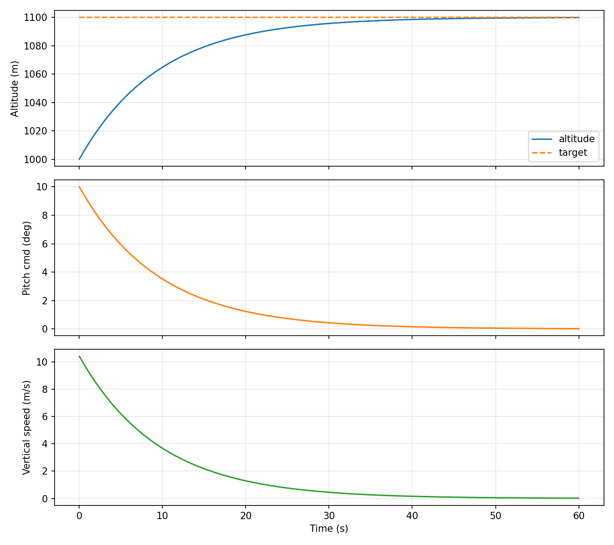

# Aircraft Altitude-Hold Simulation

A C++17 real-time simulation of an aircraft holding a target altitude,
built to practice the core pieces of an integrated vehicle simulator.

## Features
- Fixed-timestep (50 Hz) simulation loop with real-time pacing and overrun detection
- Point-mass aircraft model (pitch → vertical speed → altitude)
- PID altitude controller with output clamping and integral anti-windup
- CSV logging and a Python/matplotlib analysis script
- GoogleTest unit and closed-loop tests
- GitHub Actions CI building and testing on Linux

## Build and run
```bash
cmake -S . -B build
cmake --build build
./build/sim              # runs the sim, writes sim_log.csv
./build/sim_tests        # runs the tests
python3 tools/plot.py    # plots the results
```

## Results


## Layout
- `src/` simulation core (aircraft, PID, simulation loop)
- `tests/` unit and closed-loop tests
- `tools/` log plotting